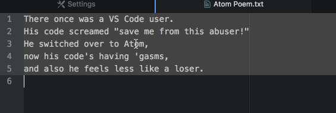

# Text Align

An [Atom](https://atom.io) text editor package that supports left aligning,
centering, right aligning, and justification of text between the left side of
the editor and the Preferred Line Length setting.

## `text-align` in Action:

## Description:

* This package aims to be useful when aligning items in academic papers, but you
may find other uses for it.
* If no selection is made, text on the line of the cursor is aligned.  
* If a selection is made, all lines of text containing the selection
will be aligned.
* Any line exceeding the Preferred Line Length setting will be ignored as well
as blank lines.

## Future Features:

* Add a de-justify command (possibly).  Currently, left/center/right aligning
is easy to fix, since spacing is only added around the text and the user can
simply just toggle another alignment command.  However, justify can't be fixed
without using undo, which means that it will be stuck that way if undoing isn't
possible or if the undo is too far back in the undo history.  So this means it
might make sense to add a de-justify algorithm, although I'll need to think
about this for a bit.

## Bugs:

* Not working with certain elements in code files (like ending brackets and
braces), however, I cannot imagine anyone using this package to manipulate code.
At any rate, I will try to fix this.

## TODO:

* Currently, the `justify` algorithm does its best to evenly distribute spaces
between words in a line, but then any leftover spaces will get places into the
leftmost spaces and slowly work their way towards the right.  This was just my
initial solution to get the package out, but I realize that this left-heavy
space placement is a bit unappealing in its asymmetry.  I'd like to work on it
so that it evenly places spaces on the left side of a row, on the right side,
and in the center.
* Work on efficiency of algorithms - these algorithms are fairly slow on larger
chunks of text, this has a lot to do with the implementation and the refactoring
I did to make the code more readable.  Passing around large objects from
function to function for each line of text might be the culprit.  I absolutely
welcome any pull requests that might lead to more efficient solutions.

## Notes:

* You will not find v0.1.0 at all.  v0.1.0 relates to an earlier version of this
package called `center-align` and is no longer published.
