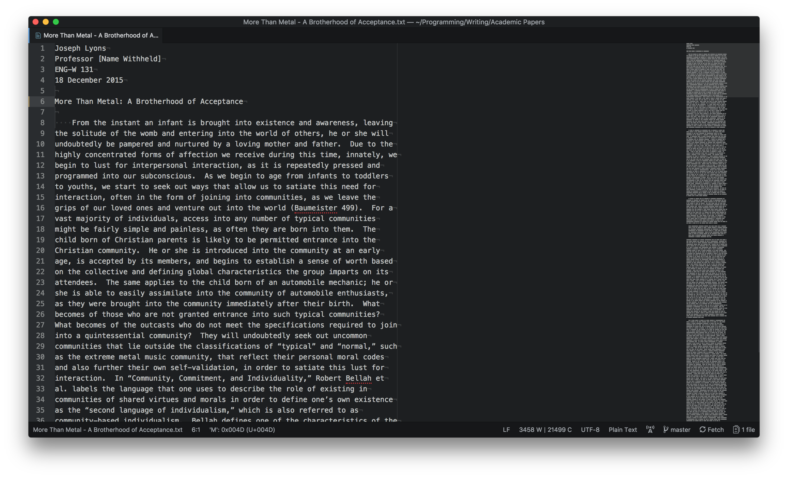
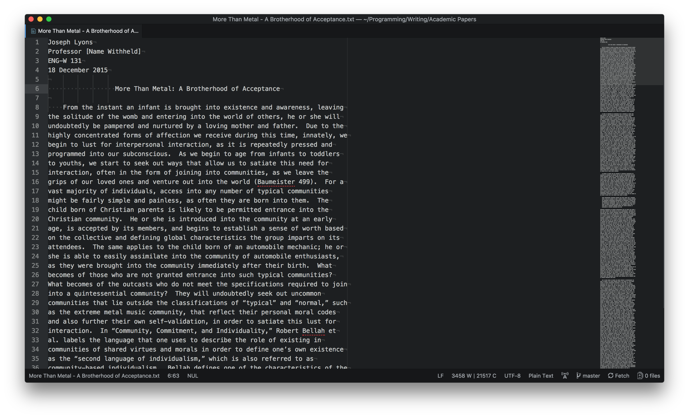
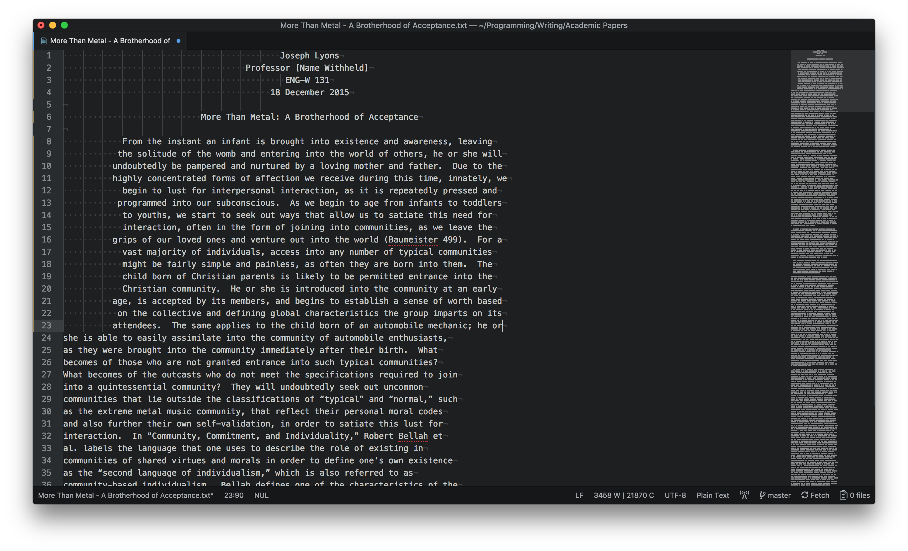

# Text Align
An [Atom](https://atom.io) text editor package that left, center, and right
aligns text between the left side of the editor and the Preferred Line Length
setting.

## Before Single Line

## After Single Line

## Before Selection

## After Selection

## Description:

* If no selection is made, text on the line of the cursor is aligned.  
* If a selection is made, all text within the selection will be aligned.
* This package is most useful when aligning items in academic papers.

## Future Features:

## Bug(s):

* Not working with certain elements in code files (like ending brackets and
braces), however, I don't see many people using it in code.  At any rate, I will
try to fix this.

## TODO:

* Work on efficiency of algorithm
* Clean up algorithm
* Add new pictures to showcase other alignment options
* Rename everything in this repo to "text-align" or something: README.md, all
code, folder, github repo (just go through all files individually and search old
name)
* Make sure all commands are supported:
    - [x] Context Menu
        - [x] Left
        - [x] Right
        - [x] Center
    - [ ] Package Menu
        - [x] Left
        - [ ] Right
        - [x] Center
    - [x] Command Palette
        - [x] Left
        - [x] Right
        - [x] Center
    - [x] Key Commands
        - [x] Left
        - [x] Right
        - [x] Center
* Merge into master and delete branch
* Publish to atom.io
